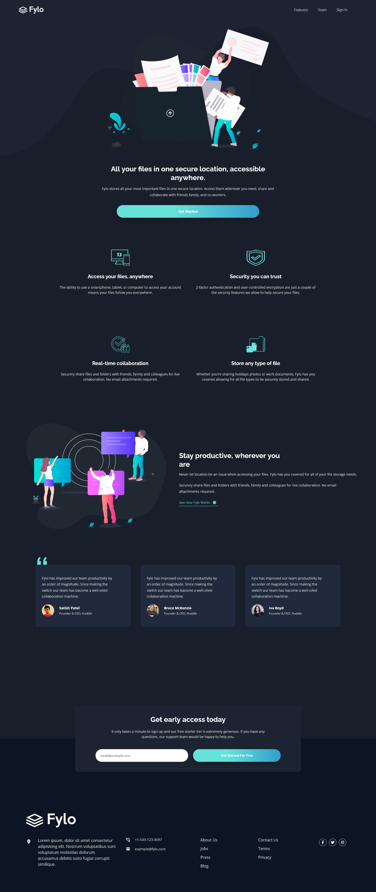
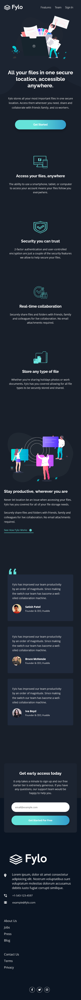

# Frontend Mentor - Fylo dark theme landing page solution

This is a solution to the [Fylo dark theme landing page challenge on Frontend Mentor](https://www.frontendmentor.io/challenges/fylo-dark-theme-landing-page-5ca5f2d21e82137ec91a50fd).

## Table of contents

- [Overview](#overview)
  - [The challenge](#the-challenge)
  - [Screenshots](#screenshots)
  - [Links](#links)
- [My process](#my-process)
  - [Built with](#built-with)
  - [What I learned](#what-i-learned)
- [Author](#author)

## Overview

### The challenge

Users should be able to:

- View the optimal layout for the site depending on their device's screen size
- See hover states for all interactive elements on the page

### Screenshots

### Links

- Project URL: [Add solution URL here](https://my-frontend-mentor-fylo-dark-theme-landing-page.netlify.app/)

## My process

### Built with

- Semantic HTML5 markup
- CSS
- Flexbox
- CSS Grid
- Mobile-first workflow

### What I learned

Learned to change colors on SVG files and to play with element's position.

## Author

- Frontend Mentor - [@zilvis149](https://www.frontendmentor.io/profile/zilvis149)
